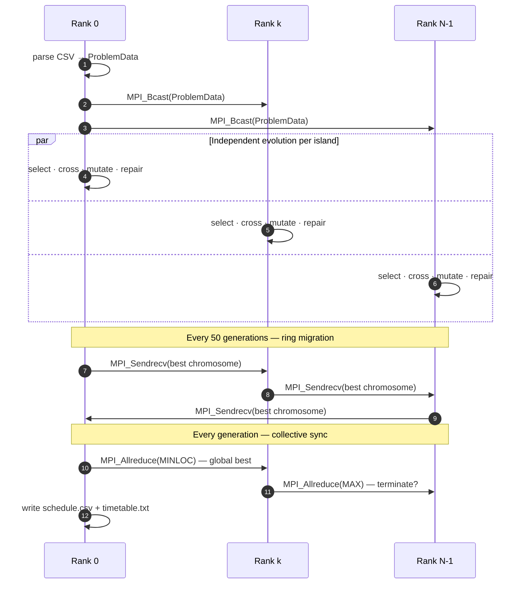

# Parallel GA for University Course Timetabling

> A C99 / MPI solver for the University Course Timetabling Problem (UCTP), built on the **Island Model** with ring migration.


UCTP is **NP-hard**. Each MPI rank owns an isolated subpopulation (an *island*); islands evolve independently and exchange migrants on a ring topology every 50 generations. The two collective synchronisation points — *who has the global best?* and *can we all stop now?* — are folded into a pair of `MPI_Allreduce` calls so islands never deadlock waiting for one another.

**AGH University of Krakow** · Systems Parallel and Distributed · Project #26

---

## At a glance



## The problem

We assign every event $e \in \mathcal{E}$ (lecture, lab, seminar) to a pair $(t, r) \in \mathcal{T} \times \mathcal{R}$ minimising

$$
\mathcal{F}(\mathbf{x}) \;=\; w_h \cdot H(\mathbf{x}) + w_s \cdot S(\mathbf{x}), \qquad w_h \gg w_s
$$

where $H(\mathbf{x})$ counts hard violations (must reach 0) and $S(\mathbf{x})$ aggregates soft penalties.

| Layer | Counted as | Examples |
|---|---|---|
| **Hard** | $H(\mathbf{x})$ — must reach 0 | room / teacher / group collisions, room-type mismatch |
| **Soft** | $S(\mathbf{x})$ — minimise | gaps between classes, late slots, day compactness, building continuity, capacity mismatch |

## Algorithm

| Operator | Choice | Why |
|---|---|---|
| Selection | Tournament $K=3$, two-level | Hard before soft — feasibility first |
| Crossover | Uniform $50/50$, $p_c = 0.8$ | Maximum gene-level diversity |
| Mutation | Adaptive: 5 % when $H>0$, 1 % when $H=0$ | Explore, then exploit |
| Repair | Greedy: 20 random probes + scan, ≤ 100 iters | Drag $H \to 0$ before soft penalties matter |
| Migration | Ring topology, every 50 gens | Local gene flow keeps islands distinct |
| Local search | Hill climbing, 5000 iters post-GA | Polish global best |
| Stop | `Allreduce(MAX)` on per-rank stop flags | Synchronous exit — no rank-stranded deadlock |

Population: **200 individuals**, sharded as $\lceil 200/N \rceil$ per island.

## Results

Wall time ≥ 3 runs per configuration on a 16-rank MPI cluster:

| Events | $T_1$ | $T_{16}$ | Speedup | Hard violations |
|---:|---:|---:|---:|:---:|
| 100 | 3.20 s | 0.27 s | **11.9×** | 0 |
| 200 | 15.0 s | 0.61 s | **24.6×** | 0 |
| 400 | 53.4 s | 1.86 s | **28.7×** | 0 |
| 1058 | 190 s | 9.70 s | **19.6×** | 0 |

> [!NOTE]
> Speedups exceed the rank count on the 200- and 400-event instances: each island explores a different region of the search space and the *combined* time-to-solution drops faster than the work-per-rank.

## Build & run

```bash
make
```

> [!TIP]
> If your cluster ships a custom MPI environment, source it before `make`. Nothing in this project requires anything beyond a working `mpicc` and `mpiexec`.

```bash
# Single rank — sanity check
mpiexec -n 1 ./timetable_ga data/simple_n100/

# Island model on 4 ranks (one host)
mpiexec -n 4 ./timetable_ga data/simple_n100/

# Cluster — provide your own hostfile listing N nodes
mpiexec -f nodes -n 16 ./timetable_ga data/simple_n100/
```

### Benchmarks & charts

```bash
make benchmark    # 5 runs × {1,2,4,8,16} ranks
make plot         # speedup + convergence (gnuplot)
```

### Visualisation

```bash
bash demo.sh      # converts data + serves an SPA at http://localhost:8080
```

## Source map

```
src/
├── main.c          MPI bootstrap, CSV broadcast
├── ga.c            Selection, crossover, mutation, ring migration
├── fitness.c       Hard/soft evaluation, greedy repair, local search
├── io.c            CSV parsing, timetable rendering
├── types.h         Room · Teacher · Event · Individual
└── pcg_basic.c     PCG32 PRNG (Apache 2.0, Melissa O'Neill)
scripts/            UniTime → CSV converter, REST + SPA server
plots/              gnuplot scripts + generated charts
```

> [!IMPORTANT]
> Input CSVs are **not committed** — they contain real personnel data. See [`data/README.md`](data/README.md) for the expected schema and how to regenerate a synthetic dataset.

<details>
<summary><b>References</b></summary>

- K. Bańczyk, H. Boiński, A. Krawczyk. *Parallelisation of GA for University Course Timetable Optimisation.* IEEE PARELEC, 2006.
- H. Faris, A. Sheta, E. Tobal. *A Parallel GA for Solving Time Tabling Problem.* ICGST AIML, 2008.
- M. O'Neill. *PCG: A Family of Simple Fast Space-Efficient Statistically Good Algorithms for Random Number Generation* — [pcg-random.org](http://www.pcg-random.org)

</details>

## Authors

- Dawid Piotrowski — [@LeoTheOriginal](https://github.com/LeoTheOriginal)
- Julia Przeździk — [@juliaprzezdzik](https://github.com/juliaprzezdzik)

## License

Educational project. Bundled PCG32 PRNG is Apache 2.0 © Melissa O'Neill.
